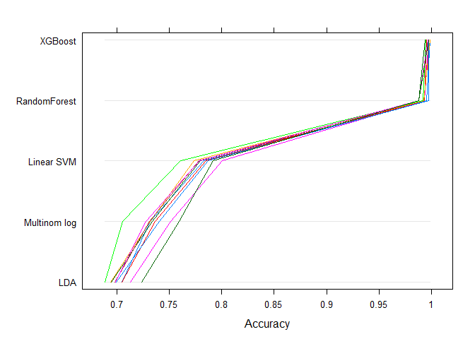

## Summary

For this project, machine learning algorithms will be used in an attempt to correctly classify five ways of performing the Unilateral Dumbell Biceps Curl. To do so, the data is processed and cleaned, after which five different models are estimated and cross-validated to evaluate which model can classify the data best and how well it does so. The results show that the best performing model uses gradient boosting, with an in sample error of 0.29% and an out of sample error of 0.53%. 

## Introduction
Using devices such as Jawbone Up, Nike FuelBand, and Fitbit it is now possible to collect a large amount of data about personal activity relatively inexpensively. These type of devices are part of the quantified self movement - a group of enthusiasts who take measurements about themselves regularly to improve their health, to find patterns in their behavior, or because they are tech geeks. One thing that people regularly do is quantify how much of a particular activity they do, but they rarely quantify how well they do it. In this project, the goal is to use data from accelerometers on the belt, forearm, arm, and dumbell of 6 participants to predict in which way the Unilateral Dumbell Biceps Curl (UDBC) is performed by a participant. They were asked to perform UDBC lifts correctly and incorrectly in 5 different ways. The  `classe` variable indicates how the activity was performed, where A indicates performance according to the specification, whereas B, C, D and E are classes which indicate common mistakes. 

More information is available from the website here: http://web.archive.org/web/20161224072740/http:/groupware.les.inf.puc-rio.br/har

## Library and data
First, the required packages for the analysis must be loaded and the data must be read into R. 


```r
# Library
library(ggplot2)
library(scales)
library(dplyr)
library(magrittr)
library(caret)
library(MASS)
library(nnet)
library(randomForest)
library(parallel)
library(doParallel)
library(e1071)
library(knitr)
```


```r
# Working directory
setwd("D:/R Directories/Coursera/Practical Machine Learning/PML")

# Load test- and train datasets
test <- read.csv("pml-testing.csv")
train <- read.csv("pml-training.csv")
```

## Cleaning the dataset
Using the `str` function, an initial idea of the dataset can be obtained, the output of which can be found in appendix A. Several issues are immediately apparent:

* The first 7 variables do not stem from accelerometer measurements, whereas the goal of this project is to use accelerometer data for predictions;
* Many variables contain missing values.

The first issue is easily tackled, as the first 7 variables can simply be removed. Additionally, the response variable `classe` will be put into a seperate vector, while column 160 of the test set (problem_id) will also be removed, as it is an ID column. To address the second issue, more insight in the occurence of missing values in the data is required.


```r
# Remove response and unnecessary variables
response <- train[,160]
train <- train[,-c(1:7, 160)]
test <- test[,-c(1:7, 160)]

# Missing values
dfm <- rbind(train,test) %>%
      apply(2, as.numeric) %>%
      apply(2, function(x) sum(is.na(x))) %>%
      {data.frame(Names=names(.), MV=.)}

tbl <- table(dfm$MV)
tbl <- data.frame(names(tbl), as.numeric(tbl))
colnames(tbl) <- c("Number of missing values", "Frequency")

kable(tbl, format="html", caption="Frequencies of missing values")
```

<table>
<caption>Frequencies of missing values</caption>
 <thead>
  <tr>
   <th style="text-align:left;"> Number of missing values </th>
   <th style="text-align:right;"> Frequency </th>
  </tr>
 </thead>
<tbody>
  <tr>
   <td style="text-align:left;"> 0 </td>
   <td style="text-align:right;"> 52 </td>
  </tr>
  <tr>
   <td style="text-align:left;"> 19236 </td>
   <td style="text-align:right;"> 67 </td>
  </tr>
  <tr>
   <td style="text-align:left;"> 19237 </td>
   <td style="text-align:right;"> 1 </td>
  </tr>
  <tr>
   <td style="text-align:left;"> 19238 </td>
   <td style="text-align:right;"> 1 </td>
  </tr>
  <tr>
   <td style="text-align:left;"> 19240 </td>
   <td style="text-align:right;"> 1 </td>
  </tr>
  <tr>
   <td style="text-align:left;"> 19241 </td>
   <td style="text-align:right;"> 4 </td>
  </tr>
  <tr>
   <td style="text-align:left;"> 19245 </td>
   <td style="text-align:right;"> 1 </td>
  </tr>
  <tr>
   <td style="text-align:left;"> 19246 </td>
   <td style="text-align:right;"> 4 </td>
  </tr>
  <tr>
   <td style="text-align:left;"> 19247 </td>
   <td style="text-align:right;"> 2 </td>
  </tr>
  <tr>
   <td style="text-align:left;"> 19268 </td>
   <td style="text-align:right;"> 2 </td>
  </tr>
  <tr>
   <td style="text-align:left;"> 19313 </td>
   <td style="text-align:right;"> 1 </td>
  </tr>
  <tr>
   <td style="text-align:left;"> 19314 </td>
   <td style="text-align:right;"> 1 </td>
  </tr>
  <tr>
   <td style="text-align:left;"> 19316 </td>
   <td style="text-align:right;"> 2 </td>
  </tr>
  <tr>
   <td style="text-align:left;"> 19319 </td>
   <td style="text-align:right;"> 1 </td>
  </tr>
  <tr>
   <td style="text-align:left;"> 19320 </td>
   <td style="text-align:right;"> 4 </td>
  </tr>
  <tr>
   <td style="text-align:left;"> 19321 </td>
   <td style="text-align:right;"> 2 </td>
  </tr>
  <tr>
   <td style="text-align:left;"> 19642 </td>
   <td style="text-align:right;"> 6 </td>
  </tr>
</tbody>
</table>


The table shows the amount of columns which have a specific sum of missing values. Accordingly, there are 52 columns which have no missing values, while all other columns have between 19236 and 19642 missing values. Given that the combined dataset contains 19642 observations, imputation cannot be used to clean these variables for analysis. Hence, all columns which contain missing values shall be removed from the dataset.


```r
# Remove variables with too many MV's
dfm <- dfm %>%
      filter(MV >0) %>%
      .$Names
      
train <- train[,!(names(train) %in% dfm)]
test <- test[,!(names(test) %in% dfm)]
rm(dfm)
```

Before proceeding to the analysis, a last check on the variables is performed to evaluate if any of them have (near-) zero variance, as this may be problematic for further analyses. To do so, `nearZeroVar` from caret is used, the output of which can be found in appendix B.

As the output contains no (near-) zero variance variables, the next step is to split the data set.

# Splitting the data set
As the project requires an estimate for both the in sample error and out of sample error, the training set is split into a training and validation set. The training set, which will contain 75% of the observations, will then be used to pick the best model for prediction, which will subsequently be used on the validation set, which contains the remaining 25% of observations, to estimate out of sample error. Note that the response vector is also split.


```r
# Split training set
inTrain <- createDataPartition(response, p=3/4, list=F)
valid <- train[-inTrain,]
train <- train[inTrain,]
responseT <- response[inTrain]
responseV <- response[-inTrain]
rm(inTrain, response)
```

## Model testing
To evaluate how well the response variable can be predicted, five machine learning algorithms will be tested:

* Multinomial logistic regression;
* Linear discriminant analysis;
* Random forest;
* Support vector machine (with linear kernel);
* Gradient boosting.

To pick the best model, cross validation is used with 10 folds. Additionally, the used variables are centered and scaled, to further increase the predictive power of the models.


```r
# Training parameters
ctrl <- trainControl(method="cv", number=10, allowParallel=T)
preP <- preProcess(train, method=c("center", "scale"))
train_stand <- predict(preP, train)
```

As the estimation of the models can be quite computationally demanding, parallel processing is used to speed up the process. Note that this is completely optional, and can be opted out of by not running the subsequent code chunck and setting `allowParallel` in the previous code chunck equal to FALSE (F).


```r
# Enable parallelized computing
cluster <- makeCluster(detectCores()-1)
registerDoParallel(cluster)
```

Next, the models are estimated and saved for subsequent evaluation.


```r
# Multinomial logistic regression
set.seed(2017)
logfit <- train(x=train_stand, y=responseT, method="multinom", 
                trControl=ctrl, trace=FALSE)

# Linear discriminant analysis
set.seed(2017)
ldafit <- train(x=train_stand, y=responseT, method="lda", 
                trControl=ctrl)

# Random forest
set.seed(2017)
rffit <- train(x=train_stand, y=responseT, method="rf", 
               trControl=ctrl)

# Support vector machine with linear kernel
set.seed(2017)
lsvmfit <- train(x=train_stand, y=responseT, method="svmLinear", 
                 tunelength=14, trControl=ctrl)

# XGBOOST
set.seed(2017)
xgbfit <- train(x=train_stand, y=responseT, method="xgbLinear",  
                trControl=ctrl, nthread=1)

# Stop parallel
stopCluster(cluster)
rm(cluster)
```

Having estimated all models, the subsequent code is used to combine all models into one object, after which a parallel plot is shown and the `summary` function is used to analyse the results.


```r
#
allResamples <- resamples(list("Multinom log" = logfit,
                               "LDA" = ldafit,
                               "RandomForest" = rffit,
                               "Linear SVM" = lsvmfit,
                               "XGBoost" = xgbfit)
)
parallelplot(allResamples)
```

<!-- -->

As is apparant from the parallel plot, the RandomForest and XGBoost models vastly outperformed the other models on all folds, with accuracies close to 1. Furthermore, the XGBoost models seem to outperform the RandomForest models by a fraction, which is best further analyzed by using summary statistics.


```r
summary(allResamples)
```

```

Call:
summary.resamples(object = allResamples)

Models: Multinom log, LDA, RandomForest, Linear SVM, XGBoost 
Number of resamples: 10 

Accuracy 
               Min. 1st Qu. Median   Mean 3rd Qu.   Max. NA's
Multinom log 0.7056  0.7313 0.7331 0.7350  0.7393 0.7595    0
LDA          0.6886  0.6955 0.6992 0.7021  0.7050 0.7235    0
RandomForest 0.9878  0.9888 0.9929 0.9924  0.9947 0.9973    0
Linear SVM   0.7607  0.7783 0.7813 0.7819  0.7867 0.8003    0
XGBoost      0.9939  0.9956 0.9969 0.9966  0.9973 0.9986    0

Kappa 
               Min. 1st Qu. Median   Mean 3rd Qu.   Max. NA's
Multinom log 0.6259  0.6597 0.6614 0.6640  0.6693 0.6950    0
LDA          0.6051  0.6148 0.6190 0.6230  0.6271 0.6499    0
RandomForest 0.9845  0.9858 0.9910 0.9904  0.9933 0.9966    0
Linear SVM   0.6953  0.7183 0.7223 0.7228  0.7288 0.7464    0
XGBoost      0.9923  0.9944 0.9961 0.9957  0.9966 0.9983    0
```

As can be seen from the accuracy table, overall the models performed quite well, as the worst model (LDA) already had an accuracy of 0.6836. The RandomForest and XGBoost models performed best, as was also seen in the parallel plot, with XGBoost achieving the highest accuracy, albeit by a fraction. 

The XGBoost models produced the following classifications:


```r
confusionMatrix(xgbfit)
```

```
Cross-Validated (10 fold) Confusion Matrix 

(entries are percentual average cell counts across resamples)
 
          Reference
Prediction    A    B    C    D    E
         A 28.4  0.0  0.0  0.0  0.0
         B  0.0 19.3  0.1  0.0  0.0
         C  0.0  0.0 17.3  0.1  0.0
         D  0.0  0.0  0.1 16.3  0.0
         E  0.0  0.0  0.0  0.0 18.3
                            
 Accuracy (average) : 0.9966
```

The confusion matrix shows that the models only misclassified among the wrongfully executed UDBC's, whereas it correctly classified all correct performances. With an overall in sample error of 0.0029, the next step is to evaluate the best model's estimated out of sample error by using the validation set.


```r
# Out of sample error
preddat <- predict(preP, valid)
yclass <- predict(xgbfit, preddat)
confusionMatrix(yclass, responseV)
```

```
Confusion Matrix and Statistics

          Reference
Prediction    A    B    C    D    E
         A 1394    0    0    0    0
         B    1  949    2    0    0
         C    0    0  853    2    0
         D    0    0    0  801    0
         E    0    0    0    1  901

Overall Statistics
                                          
               Accuracy : 0.9988          
                 95% CI : (0.9973, 0.9996)
    No Information Rate : 0.2845          
    P-Value [Acc > NIR] : < 2.2e-16       
                                          
                  Kappa : 0.9985          
 Mcnemar's Test P-Value : NA              

Statistics by Class:

                     Class: A Class: B Class: C Class: D Class: E
Sensitivity            0.9993   1.0000   0.9977   0.9963   1.0000
Specificity            1.0000   0.9992   0.9995   1.0000   0.9998
Pos Pred Value         1.0000   0.9968   0.9977   1.0000   0.9989
Neg Pred Value         0.9997   1.0000   0.9995   0.9993   1.0000
Prevalence             0.2845   0.1935   0.1743   0.1639   0.1837
Detection Rate         0.2843   0.1935   0.1739   0.1633   0.1837
Detection Prevalence   0.2843   0.1941   0.1743   0.1633   0.1839
Balanced Accuracy      0.9996   0.9996   0.9986   0.9981   0.9999
```

Using the validation set, similar results arise from the confusion matrix. The model has been able to correctly classify all correct executions of the UDBC, while making only few mistakes in the classification of the wrongful executions of the exercise. With an out of sample error of 0.0053, the model is ready to be used on the test set.


```r
# Preprocess testdata and classify
testdat <- predict(preP, test)
yclass <- predict(xgbfit, testdat)
yclass
```

```
 [1] B A B A A E D B A A B C B A E E A B B B
Levels: A B C D E
```

Having obtained these predictions, which will be used in the Course Project Prediction Quiz, this report has reached its end. For those who have read all the way through it, thank you for your time, and I hope you found my analysis interesting!
<br>
<br>

## Appendix

### A.

```r
str(strdf[,1:99])
```

```
## 'data.frame':	19622 obs. of  99 variables:
##  $ X                      : int  1 2 3 4 5 6 7 8 9 10 ...
##  $ user_name              : Factor w/ 6 levels "adelmo","carlitos",..: 2 2 2 2 2 2 2 2 2 2 ...
##  $ raw_timestamp_part_1   : int  1323084231 1323084231 1323084231 1323084232 1323084232 1323084232 1323084232 1323084232 1323084232 1323084232 ...
##  $ raw_timestamp_part_2   : int  788290 808298 820366 120339 196328 304277 368296 440390 484323 484434 ...
##  $ cvtd_timestamp         : Factor w/ 20 levels "02/12/2011 13:32",..: 9 9 9 9 9 9 9 9 9 9 ...
##  $ new_window             : Factor w/ 2 levels "no","yes": 1 1 1 1 1 1 1 1 1 1 ...
##  $ num_window             : int  11 11 11 12 12 12 12 12 12 12 ...
##  $ roll_belt              : num  1.41 1.41 1.42 1.48 1.48 1.45 1.42 1.42 1.43 1.45 ...
##  $ pitch_belt             : num  8.07 8.07 8.07 8.05 8.07 8.06 8.09 8.13 8.16 8.17 ...
##  $ yaw_belt               : num  -94.4 -94.4 -94.4 -94.4 -94.4 -94.4 -94.4 -94.4 -94.4 -94.4 ...
##  $ total_accel_belt       : int  3 3 3 3 3 3 3 3 3 3 ...
##  $ kurtosis_roll_belt     : Factor w/ 397 levels "","-0.016850",..: 1 1 1 1 1 1 1 1 1 1 ...
##  $ kurtosis_picth_belt    : Factor w/ 317 levels "","-0.021887",..: 1 1 1 1 1 1 1 1 1 1 ...
##  $ kurtosis_yaw_belt      : Factor w/ 2 levels "","#DIV/0!": 1 1 1 1 1 1 1 1 1 1 ...
##  $ skewness_roll_belt     : Factor w/ 395 levels "","-0.003095",..: 1 1 1 1 1 1 1 1 1 1 ...
##  $ skewness_roll_belt.1   : Factor w/ 338 levels "","-0.005928",..: 1 1 1 1 1 1 1 1 1 1 ...
##  $ skewness_yaw_belt      : Factor w/ 2 levels "","#DIV/0!": 1 1 1 1 1 1 1 1 1 1 ...
##  $ max_roll_belt          : num  NA NA NA NA NA NA NA NA NA NA ...
##  $ max_picth_belt         : int  NA NA NA NA NA NA NA NA NA NA ...
##  $ max_yaw_belt           : Factor w/ 68 levels "","-0.1","-0.2",..: 1 1 1 1 1 1 1 1 1 1 ...
##  $ min_roll_belt          : num  NA NA NA NA NA NA NA NA NA NA ...
##  $ min_pitch_belt         : int  NA NA NA NA NA NA NA NA NA NA ...
##  $ min_yaw_belt           : Factor w/ 68 levels "","-0.1","-0.2",..: 1 1 1 1 1 1 1 1 1 1 ...
##  $ amplitude_roll_belt    : num  NA NA NA NA NA NA NA NA NA NA ...
##  $ amplitude_pitch_belt   : int  NA NA NA NA NA NA NA NA NA NA ...
##  $ amplitude_yaw_belt     : Factor w/ 4 levels "","#DIV/0!","0.00",..: 1 1 1 1 1 1 1 1 1 1 ...
##  $ var_total_accel_belt   : num  NA NA NA NA NA NA NA NA NA NA ...
##  $ avg_roll_belt          : num  NA NA NA NA NA NA NA NA NA NA ...
##  $ stddev_roll_belt       : num  NA NA NA NA NA NA NA NA NA NA ...
##  $ var_roll_belt          : num  NA NA NA NA NA NA NA NA NA NA ...
##  $ avg_pitch_belt         : num  NA NA NA NA NA NA NA NA NA NA ...
##  $ stddev_pitch_belt      : num  NA NA NA NA NA NA NA NA NA NA ...
##  $ var_pitch_belt         : num  NA NA NA NA NA NA NA NA NA NA ...
##  $ avg_yaw_belt           : num  NA NA NA NA NA NA NA NA NA NA ...
##  $ stddev_yaw_belt        : num  NA NA NA NA NA NA NA NA NA NA ...
##  $ var_yaw_belt           : num  NA NA NA NA NA NA NA NA NA NA ...
##  $ gyros_belt_x           : num  0 0.02 0 0.02 0.02 0.02 0.02 0.02 0.02 0.03 ...
##  $ gyros_belt_y           : num  0 0 0 0 0.02 0 0 0 0 0 ...
##  $ gyros_belt_z           : num  -0.02 -0.02 -0.02 -0.03 -0.02 -0.02 -0.02 -0.02 -0.02 0 ...
##  $ accel_belt_x           : int  -21 -22 -20 -22 -21 -21 -22 -22 -20 -21 ...
##  $ accel_belt_y           : int  4 4 5 3 2 4 3 4 2 4 ...
##  $ accel_belt_z           : int  22 22 23 21 24 21 21 21 24 22 ...
##  $ magnet_belt_x          : int  -3 -7 -2 -6 -6 0 -4 -2 1 -3 ...
##  $ magnet_belt_y          : int  599 608 600 604 600 603 599 603 602 609 ...
##  $ magnet_belt_z          : int  -313 -311 -305 -310 -302 -312 -311 -313 -312 -308 ...
##  $ roll_arm               : num  -128 -128 -128 -128 -128 -128 -128 -128 -128 -128 ...
##  $ pitch_arm              : num  22.5 22.5 22.5 22.1 22.1 22 21.9 21.8 21.7 21.6 ...
##  $ yaw_arm                : num  -161 -161 -161 -161 -161 -161 -161 -161 -161 -161 ...
##  $ total_accel_arm        : int  34 34 34 34 34 34 34 34 34 34 ...
##  $ var_accel_arm          : num  NA NA NA NA NA NA NA NA NA NA ...
##  $ avg_roll_arm           : num  NA NA NA NA NA NA NA NA NA NA ...
##  $ stddev_roll_arm        : num  NA NA NA NA NA NA NA NA NA NA ...
##  $ var_roll_arm           : num  NA NA NA NA NA NA NA NA NA NA ...
##  $ avg_pitch_arm          : num  NA NA NA NA NA NA NA NA NA NA ...
##  $ stddev_pitch_arm       : num  NA NA NA NA NA NA NA NA NA NA ...
##  $ var_pitch_arm          : num  NA NA NA NA NA NA NA NA NA NA ...
##  $ avg_yaw_arm            : num  NA NA NA NA NA NA NA NA NA NA ...
##  $ stddev_yaw_arm         : num  NA NA NA NA NA NA NA NA NA NA ...
##  $ var_yaw_arm            : num  NA NA NA NA NA NA NA NA NA NA ...
##  $ gyros_arm_x            : num  0 0.02 0.02 0.02 0 0.02 0 0.02 0.02 0.02 ...
##  $ gyros_arm_y            : num  0 -0.02 -0.02 -0.03 -0.03 -0.03 -0.03 -0.02 -0.03 -0.03 ...
##  $ gyros_arm_z            : num  -0.02 -0.02 -0.02 0.02 0 0 0 0 -0.02 -0.02 ...
##  $ accel_arm_x            : int  -288 -290 -289 -289 -289 -289 -289 -289 -288 -288 ...
##  $ accel_arm_y            : int  109 110 110 111 111 111 111 111 109 110 ...
##  $ accel_arm_z            : int  -123 -125 -126 -123 -123 -122 -125 -124 -122 -124 ...
##  $ magnet_arm_x           : int  -368 -369 -368 -372 -374 -369 -373 -372 -369 -376 ...
##  $ magnet_arm_y           : int  337 337 344 344 337 342 336 338 341 334 ...
##  $ magnet_arm_z           : int  516 513 513 512 506 513 509 510 518 516 ...
##  $ kurtosis_roll_arm      : Factor w/ 330 levels "","-0.02438",..: 1 1 1 1 1 1 1 1 1 1 ...
##  $ kurtosis_picth_arm     : Factor w/ 328 levels "","-0.00484",..: 1 1 1 1 1 1 1 1 1 1 ...
##  $ kurtosis_yaw_arm       : Factor w/ 395 levels "","-0.01548",..: 1 1 1 1 1 1 1 1 1 1 ...
##  $ skewness_roll_arm      : Factor w/ 331 levels "","-0.00051",..: 1 1 1 1 1 1 1 1 1 1 ...
##  $ skewness_pitch_arm     : Factor w/ 328 levels "","-0.00184",..: 1 1 1 1 1 1 1 1 1 1 ...
##  $ skewness_yaw_arm       : Factor w/ 395 levels "","-0.00311",..: 1 1 1 1 1 1 1 1 1 1 ...
##  $ max_roll_arm           : num  NA NA NA NA NA NA NA NA NA NA ...
##  $ max_picth_arm          : num  NA NA NA NA NA NA NA NA NA NA ...
##  $ max_yaw_arm            : int  NA NA NA NA NA NA NA NA NA NA ...
##  $ min_roll_arm           : num  NA NA NA NA NA NA NA NA NA NA ...
##  $ min_pitch_arm          : num  NA NA NA NA NA NA NA NA NA NA ...
##  $ min_yaw_arm            : int  NA NA NA NA NA NA NA NA NA NA ...
##  $ amplitude_roll_arm     : num  NA NA NA NA NA NA NA NA NA NA ...
##  $ amplitude_pitch_arm    : num  NA NA NA NA NA NA NA NA NA NA ...
##  $ amplitude_yaw_arm      : int  NA NA NA NA NA NA NA NA NA NA ...
##  $ roll_dumbbell          : num  13.1 13.1 12.9 13.4 13.4 ...
##  $ pitch_dumbbell         : num  -70.5 -70.6 -70.3 -70.4 -70.4 ...
##  $ yaw_dumbbell           : num  -84.9 -84.7 -85.1 -84.9 -84.9 ...
##  $ kurtosis_roll_dumbbell : Factor w/ 398 levels "","-0.0035","-0.0073",..: 1 1 1 1 1 1 1 1 1 1 ...
##  $ kurtosis_picth_dumbbell: Factor w/ 401 levels "","-0.0163","-0.0233",..: 1 1 1 1 1 1 1 1 1 1 ...
##  $ kurtosis_yaw_dumbbell  : Factor w/ 2 levels "","#DIV/0!": 1 1 1 1 1 1 1 1 1 1 ...
##  $ skewness_roll_dumbbell : Factor w/ 401 levels "","-0.0082","-0.0096",..: 1 1 1 1 1 1 1 1 1 1 ...
##  $ skewness_pitch_dumbbell: Factor w/ 402 levels "","-0.0053","-0.0084",..: 1 1 1 1 1 1 1 1 1 1 ...
##  $ skewness_yaw_dumbbell  : Factor w/ 2 levels "","#DIV/0!": 1 1 1 1 1 1 1 1 1 1 ...
##  $ max_roll_dumbbell      : num  NA NA NA NA NA NA NA NA NA NA ...
##  $ max_picth_dumbbell     : num  NA NA NA NA NA NA NA NA NA NA ...
##  $ max_yaw_dumbbell       : Factor w/ 73 levels "","-0.1","-0.2",..: 1 1 1 1 1 1 1 1 1 1 ...
##  $ min_roll_dumbbell      : num  NA NA NA NA NA NA NA NA NA NA ...
##  $ min_pitch_dumbbell     : num  NA NA NA NA NA NA NA NA NA NA ...
##  $ min_yaw_dumbbell       : Factor w/ 73 levels "","-0.1","-0.2",..: 1 1 1 1 1 1 1 1 1 1 ...
##  $ amplitude_roll_dumbbell: num  NA NA NA NA NA NA NA NA NA NA ...
```

```r
str(strdf[,100:160])
```

```
## 'data.frame':	19622 obs. of  61 variables:
##  $ amplitude_pitch_dumbbell: num  NA NA NA NA NA NA NA NA NA NA ...
##  $ amplitude_yaw_dumbbell  : Factor w/ 3 levels "","#DIV/0!","0.00": 1 1 1 1 1 1 1 1 1 1 ...
##  $ total_accel_dumbbell    : int  37 37 37 37 37 37 37 37 37 37 ...
##  $ var_accel_dumbbell      : num  NA NA NA NA NA NA NA NA NA NA ...
##  $ avg_roll_dumbbell       : num  NA NA NA NA NA NA NA NA NA NA ...
##  $ stddev_roll_dumbbell    : num  NA NA NA NA NA NA NA NA NA NA ...
##  $ var_roll_dumbbell       : num  NA NA NA NA NA NA NA NA NA NA ...
##  $ avg_pitch_dumbbell      : num  NA NA NA NA NA NA NA NA NA NA ...
##  $ stddev_pitch_dumbbell   : num  NA NA NA NA NA NA NA NA NA NA ...
##  $ var_pitch_dumbbell      : num  NA NA NA NA NA NA NA NA NA NA ...
##  $ avg_yaw_dumbbell        : num  NA NA NA NA NA NA NA NA NA NA ...
##  $ stddev_yaw_dumbbell     : num  NA NA NA NA NA NA NA NA NA NA ...
##  $ var_yaw_dumbbell        : num  NA NA NA NA NA NA NA NA NA NA ...
##  $ gyros_dumbbell_x        : num  0 0 0 0 0 0 0 0 0 0 ...
##  $ gyros_dumbbell_y        : num  -0.02 -0.02 -0.02 -0.02 -0.02 -0.02 -0.02 -0.02 -0.02 -0.02 ...
##  $ gyros_dumbbell_z        : num  0 0 0 -0.02 0 0 0 0 0 0 ...
##  $ accel_dumbbell_x        : int  -234 -233 -232 -232 -233 -234 -232 -234 -232 -235 ...
##  $ accel_dumbbell_y        : int  47 47 46 48 48 48 47 46 47 48 ...
##  $ accel_dumbbell_z        : int  -271 -269 -270 -269 -270 -269 -270 -272 -269 -270 ...
##  $ magnet_dumbbell_x       : int  -559 -555 -561 -552 -554 -558 -551 -555 -549 -558 ...
##  $ magnet_dumbbell_y       : int  293 296 298 303 292 294 295 300 292 291 ...
##  $ magnet_dumbbell_z       : num  -65 -64 -63 -60 -68 -66 -70 -74 -65 -69 ...
##  $ roll_forearm            : num  28.4 28.3 28.3 28.1 28 27.9 27.9 27.8 27.7 27.7 ...
##  $ pitch_forearm           : num  -63.9 -63.9 -63.9 -63.9 -63.9 -63.9 -63.9 -63.8 -63.8 -63.8 ...
##  $ yaw_forearm             : num  -153 -153 -152 -152 -152 -152 -152 -152 -152 -152 ...
##  $ kurtosis_roll_forearm   : Factor w/ 322 levels "","-0.0227","-0.0359",..: 1 1 1 1 1 1 1 1 1 1 ...
##  $ kurtosis_picth_forearm  : Factor w/ 323 levels "","-0.0073","-0.0442",..: 1 1 1 1 1 1 1 1 1 1 ...
##  $ kurtosis_yaw_forearm    : Factor w/ 2 levels "","#DIV/0!": 1 1 1 1 1 1 1 1 1 1 ...
##  $ skewness_roll_forearm   : Factor w/ 323 levels "","-0.0004","-0.0013",..: 1 1 1 1 1 1 1 1 1 1 ...
##  $ skewness_pitch_forearm  : Factor w/ 319 levels "","-0.0113","-0.0131",..: 1 1 1 1 1 1 1 1 1 1 ...
##  $ skewness_yaw_forearm    : Factor w/ 2 levels "","#DIV/0!": 1 1 1 1 1 1 1 1 1 1 ...
##  $ max_roll_forearm        : num  NA NA NA NA NA NA NA NA NA NA ...
##  $ max_picth_forearm       : num  NA NA NA NA NA NA NA NA NA NA ...
##  $ max_yaw_forearm         : Factor w/ 45 levels "","-0.1","-0.2",..: 1 1 1 1 1 1 1 1 1 1 ...
##  $ min_roll_forearm        : num  NA NA NA NA NA NA NA NA NA NA ...
##  $ min_pitch_forearm       : num  NA NA NA NA NA NA NA NA NA NA ...
##  $ min_yaw_forearm         : Factor w/ 45 levels "","-0.1","-0.2",..: 1 1 1 1 1 1 1 1 1 1 ...
##  $ amplitude_roll_forearm  : num  NA NA NA NA NA NA NA NA NA NA ...
##  $ amplitude_pitch_forearm : num  NA NA NA NA NA NA NA NA NA NA ...
##  $ amplitude_yaw_forearm   : Factor w/ 3 levels "","#DIV/0!","0.00": 1 1 1 1 1 1 1 1 1 1 ...
##  $ total_accel_forearm     : int  36 36 36 36 36 36 36 36 36 36 ...
##  $ var_accel_forearm       : num  NA NA NA NA NA NA NA NA NA NA ...
##  $ avg_roll_forearm        : num  NA NA NA NA NA NA NA NA NA NA ...
##  $ stddev_roll_forearm     : num  NA NA NA NA NA NA NA NA NA NA ...
##  $ var_roll_forearm        : num  NA NA NA NA NA NA NA NA NA NA ...
##  $ avg_pitch_forearm       : num  NA NA NA NA NA NA NA NA NA NA ...
##  $ stddev_pitch_forearm    : num  NA NA NA NA NA NA NA NA NA NA ...
##  $ var_pitch_forearm       : num  NA NA NA NA NA NA NA NA NA NA ...
##  $ avg_yaw_forearm         : num  NA NA NA NA NA NA NA NA NA NA ...
##  $ stddev_yaw_forearm      : num  NA NA NA NA NA NA NA NA NA NA ...
##  $ var_yaw_forearm         : num  NA NA NA NA NA NA NA NA NA NA ...
##  $ gyros_forearm_x         : num  0.03 0.02 0.03 0.02 0.02 0.02 0.02 0.02 0.03 0.02 ...
##  $ gyros_forearm_y         : num  0 0 -0.02 -0.02 0 -0.02 0 -0.02 0 0 ...
##  $ gyros_forearm_z         : num  -0.02 -0.02 0 0 -0.02 -0.03 -0.02 0 -0.02 -0.02 ...
##  $ accel_forearm_x         : int  192 192 196 189 189 193 195 193 193 190 ...
##  $ accel_forearm_y         : int  203 203 204 206 206 203 205 205 204 205 ...
##  $ accel_forearm_z         : int  -215 -216 -213 -214 -214 -215 -215 -213 -214 -215 ...
##  $ magnet_forearm_x        : int  -17 -18 -18 -16 -17 -9 -18 -9 -16 -22 ...
##  $ magnet_forearm_y        : num  654 661 658 658 655 660 659 660 653 656 ...
##  $ magnet_forearm_z        : num  476 473 469 469 473 478 470 474 476 473 ...
##  $ classe                  : Factor w/ 5 levels "A","B","C","D",..: 1 1 1 1 1 1 1 1 1 1 ...
```

### B.

```r
nzvdf
```

```
##                      freqRatio percentUnique zeroVar   nzv
## roll_belt             1.101904     6.7762957   FALSE FALSE
## pitch_belt            1.036082     9.3676815   FALSE FALSE
## yaw_belt              1.056420     9.9633439   FALSE FALSE
## total_accel_belt      1.064128     0.1476428   FALSE FALSE
## gyros_belt_x          1.059341     0.7127584   FALSE FALSE
## gyros_belt_y          1.145626     0.3512881   FALSE FALSE
## gyros_belt_z          1.063770     0.8604012   FALSE FALSE
## accel_belt_x          1.052699     0.8349455   FALSE FALSE
## accel_belt_y          1.112198     0.7280318   FALSE FALSE
## accel_belt_z          1.078767     1.5222482   FALSE FALSE
## magnet_belt_x         1.090141     1.6647999   FALSE FALSE
## magnet_belt_y         1.097978     1.5171571   FALSE FALSE
## magnet_belt_z         1.004228     2.3266470   FALSE FALSE
## roll_arm             52.461538    13.5169535   FALSE FALSE
## pitch_arm            87.461538    15.7214133   FALSE FALSE
## yaw_arm              33.106796    14.6420935   FALSE FALSE
## total_accel_arm       1.025612     0.3360147   FALSE FALSE
## gyros_arm_x           1.019380     3.2735974   FALSE FALSE
## gyros_arm_y           1.458252     1.9142653   FALSE FALSE
## gyros_arm_z           1.110476     1.2626005   FALSE FALSE
## accel_arm_x           1.005714     3.9558090   FALSE FALSE
## accel_arm_y           1.140187     2.7339375   FALSE FALSE
## accel_arm_z           1.119048     4.0321759   FALSE FALSE
## magnet_arm_x          1.000000     6.8170247   FALSE FALSE
## magnet_arm_y          1.068182     4.4394664   FALSE FALSE
## magnet_arm_z          1.036364     6.4402810   FALSE FALSE
## roll_dumbbell         1.022388    84.1971286   FALSE FALSE
## pitch_dumbbell        2.284672    81.7330211   FALSE FALSE
## yaw_dumbbell          1.132231    83.4741880   FALSE FALSE
## total_accel_dumbbell  1.071795     0.2189186   FALSE FALSE
## gyros_dumbbell_x      1.003268     1.2269626   FALSE FALSE
## gyros_dumbbell_y      1.266212     1.4153345   FALSE FALSE
## gyros_dumbbell_z      1.060100     1.0487730   FALSE FALSE
## accel_dumbbell_x      1.018018     2.1688219   FALSE FALSE
## accel_dumbbell_y      1.053061     2.3724672   FALSE FALSE
## accel_dumbbell_z      1.133333     2.0873638   FALSE FALSE
## magnet_dumbbell_x     1.098266     5.7478872   FALSE FALSE
## magnet_dumbbell_y     1.197740     4.2969148   FALSE FALSE
## magnet_dumbbell_z     1.020833     3.4416047   FALSE FALSE
## roll_forearm         11.592262    11.0783016   FALSE FALSE
## pitch_forearm        64.900000    14.8457387   FALSE FALSE
## yaw_forearm          15.266667    10.1364423   FALSE FALSE
## total_accel_forearm   1.128721     0.3563792   FALSE FALSE
## gyros_forearm_x       1.061069     1.5171571   FALSE FALSE
## gyros_forearm_y       1.033854     3.7725283   FALSE FALSE
## gyros_forearm_z       1.125000     1.5629773   FALSE FALSE
## accel_forearm_x       1.126437     4.0423582   FALSE FALSE
## accel_forearm_y       1.059406     5.1064046   FALSE FALSE
## accel_forearm_z       1.006250     2.9528561   FALSE FALSE
## magnet_forearm_x      1.000000     7.7588840   FALSE FALSE
## magnet_forearm_y      1.246914     9.5305977   FALSE FALSE
## magnet_forearm_z      1.017241     8.5683739   FALSE FALSE
```
